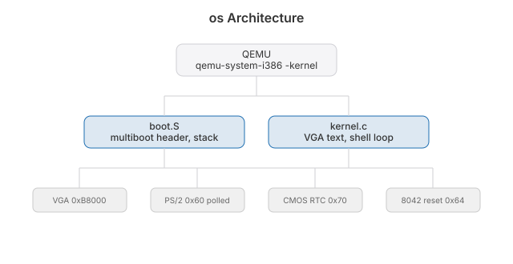

# os


A kernel. A small one, from nothing. It boots in QEMU and drops you at a prompt.

| Piece | Where |
|-------|-------|
| Boot | `boot.S`: multiboot1 header, stack, jump to `kmain` |
| Kernel | `kernel.c`: VGA text, keyboard, clock, shell |
| Link | `linker.ld`: flat ELF32 at 1 MB |
| Check | `check.sh`: boots it and checks the banner reached VGA memory |

## Build

```sh
brew install lld qemu
make run      # boots to the shell
./check.sh    # boot check
```

Commands: `help` `clear` `echo` `time` `reboot`

## Architecture



QEMU's `-kernel` loads it directly. No bootloader, no ISO. It stays in 32-bit
protected mode with no paging and never installs an interrupt table. The keyboard
is polled on port `0x60`. `time` reads the CMOS clock instead of counting ticks.
That trades a background tick for about a hundred fewer lines. Long mode, an IDT
and paging arrive when something has to run while the shell waits for a key.

## License

MIT 2026, Joshua Trommel
